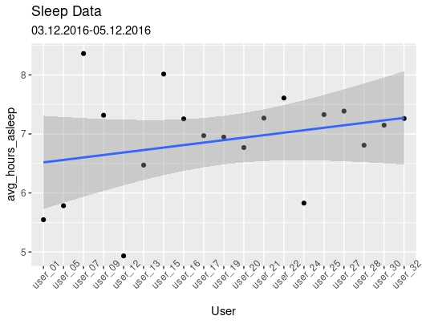
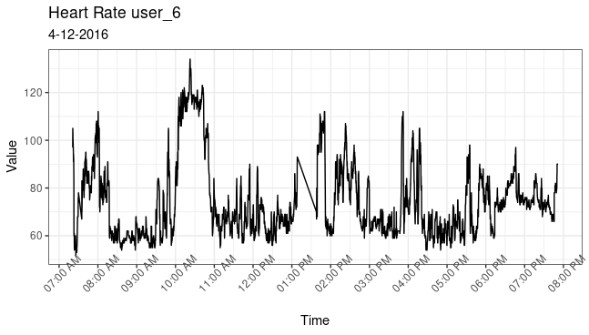
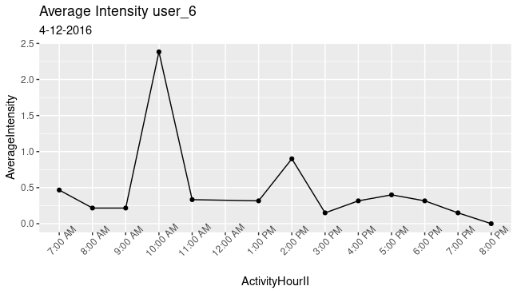
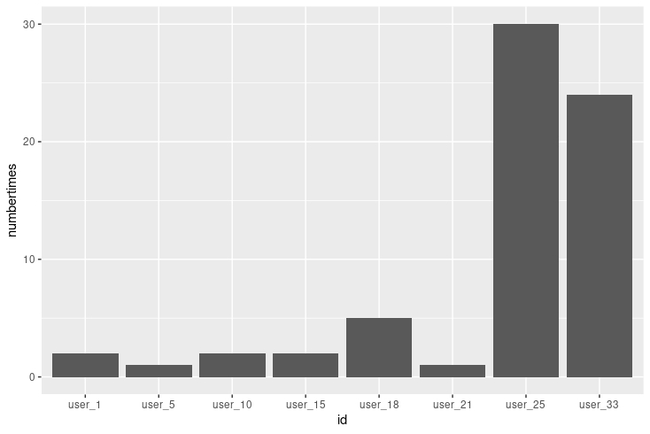

## Google Data Analytics Professional Certificate
### Capstone #1 Bellabeat
Andrew Benjamin

``` r
library(ggplot2)
library(dplyr)
library(tidyverse)
library(ezknitr)
```
## Introduction

Welcome to the Bellabeat data analysis case study! In this case study,
you will perform many real-world tasks of a junior data analyst. You
will imagine you are working for Bellabeat, a high-tech manufacturer of
health-focused products for women, and meet different characters and
team members. In order to answer the key business questions, you will
follow the steps of the data analysis process: ask, prepare, process,
analyze, share, and act. Along the way, the Case Study Roadmap tables —
including guiding questions and key tasks — will help you stay on the
right path. By the end of this lesson, you will have a portfolio-ready
case study. Download the packet and reference the details of this case
study anytime. Then, when you begin your job hunt, your case study will
be a tangible way to demonstrate your knowledge and skills to potential
employers

## Characters and products

-   Characters
    -   Urška Sršen: Bellabeat’s cofounder and Chief Creative Officer
    -   Sando Mur: Mathematician and Bellabeat’s cofounder; key member
        of the Bellabeat executive team
    -   Bellabeat marketing analytics team: A team of data analysts
        responsible for collecting, analyzing, and reporting data that
        helps guide Bellabeat’s marketing strategy. You joined this team
        six months ago and have been busy learning about Bellabeat’’s
        mission and business goals — as well as how you, as a junior
        data analyst, can help Bellabeat achieve them.
-   Products
    -   Bellabeat app: The Bellabeat app provides users with health data
        related to their activity, sleep, stress, menstrual cycle, and
        mindfulness habits. This data can help users better understand
        their current habits and make healthy decisions. The Bellabeat
        app connects to their line of smart wellness products.
    -   Leaf: Bellabeat’s classic wellness tracker can be worn as a
        bracelet, necklace, or clip. The Leaf tracker connects to the
        Bellabeat app to track activity, sleep, and stress.
    -   Time: This wellness watch combines the timeless look of a
        classic timepiece with smart technology to track user activity,
        sleep, and stress. The Time watch connects to the Bellabeat app
        to provide you with insights into your daily wellness.
    -   Spring: This is a water bottle that tracks daily water intake
        using smart technology to ensure that you are appropriately
        hydrated throughout the day. The Spring bottle connects to the
        Bellabeat app to track your hydration levels.
    -   Bellabeat membership: Bellabeat also offers a subscription-based
        membership program for users. Membership gives users 24/7 access
        to fully personalized guidance on nutrition, activity, sleep,
        health and beauty, and mindfulness based on their lifestyle and
        goals.

# Step 1 - Ask

Sršen asks you to analyze smart device usage data in order to gain
insight into how consumers use non-Bellabeat smart devices. She then
wants you to select one Bellabeat product to apply these insights to in
your presentation. These questions will guide your analysis:

1.  What are some trends in smart device usage? Sleep patterns,
    correlation between average intensity and heart rate, and missing
    weight log information.
2.  How could these trends apply to Bellabeat customers? Sleep patterns,
    data correlations, and weight log information of non Bellabeat smart
    device users will likely resemble that of Bellabeat customers, thus
    these trends in data will inform Bellabeat team of how to improve
    and market Bellabeat App or other products.
3.  How could these trends help influence Bellabeat marketing strategy?
    By leveraging the data extracted from these data sets Bellabeat will
    be able to pinpoint the usage of smart devices and focus on
    marketing those strengths to future Bellabeat customers.

**Guiding questions**

-   What is the problem you are trying to solve? How can I use the
    trends in data from non Bellabeat smart devices to influence the
    marketing strategy of one of Bellabeat’s own products?
-   How can your insights drive business decisions? The insights
    received from analyzing these data sets can help drive business
    decisions based on how to market the product, what features of the
    product to improve on, and what features to disable or ways to save
    money within the product line (least used features of the product
    based on trends in smart device data.)

#### Business Task

Bellabeat has hired a team of data analysts to analyze smart device
usage data in order to gain insight into how consumers are using
non-Bellabeat smart devices. The trends I discover in this data will
influence marketing strategy for the Bellabeat app. These insights can
help make business decisions like how to market the product, what
features of the product to enhance, and what features to disable or do
away with.

# Step 2 - Prepare

-   Where is your data stored? Excel
-   How is the data organized? Is it in long or wide format? Long
-   Are there issues with bias or credibility in this data? Yes, there
    are issues with bias and credibility because it is survey based so
    only users who are interested in responding provide the data.
    Secondly, the amount of data provided is from 30 users only which is
    not a large enough sample size for unbiased data. Lastly, there are
    outside factors which could affect data results. For example, time
    line: the data supplied is for 2 months in spring, however, exercise
    habits change from season to season.
-   Does your data ROCCC? Reliable - Yes data is from Amazon a
    trustworthy source Original - yes data comes from 30 original users
    from a specific time period Comprehensive - No, incomplete data due
    to low sample size Current - Data is relatively old (2016) Cited -
    yes, Amazon Mechanical Turk
-   How are you addressing licensing, privacy, security, and
    accessibility? No licensing/privacy issues because data comes from
    an open source, security is fine because no personal information is
    used and accessibility is easy.
-   How did you verify the data’s integrity? Maintained log of
    manipulations and kept data in one secure location
-   How does it help you answer your question? We can use the data from
    non Bellabeat smart device users to help bring analytical and data
    driven trends in user usage in order to influence the success of the
    marketing strategy of Bellabeat app.
-   Are there any problems with the data? Missing data, outliers, and
    light format issues.

#### Description of Data Sources

[FitBit Fitness Tracker
Data](https://www.kaggle.com/datasets/arashnic/fitbit) (CC0: Public
Domain, dataset made available through Mobius): This Kaggle data set
contains personal fitness tracker from thirty fitbit users. Thirty
eligible Fitbit users consented to the submission of personal tracker
data, including minute-level output for physical activity, heart rate,
and sleep monitoring. It includes information about daily activity,
steps, and heart rate that can be used to explore users’ habits.

# Step 3 - Process

-   What tools are you choosing and why? Excel and R for data
    cleaning/visualizations and tableau for a dashboard.
-   Have you ensured your data’s integrity? Throughout my process I will
    log updates/changes to data sets.
-   What steps have you taken to ensure that your data is clean? Check
    formatting, blank cells, extra white spaces, misspelling, and
    duplicates.
-   How can you verify that your data is clean and ready to analyze?
    Ensuring that formatting is correct, remove/update missing data, and
    check for misspellings and flaws.
-   Have you documented your cleaning process so you can review and
    share those results? Yes

# Documented Cleaning Process

## Import datasets

First I imported sleepDay_merged, weightLogInfo_merged,
heartrate_seconds_merged, and hourlyIntensities data sets.

``` r
sleep_data <- read.csv("/cloud/project/capstone project/R Projects/sleepDay_merged.csv")
```

``` r
weightLog_data <- read.csv("/cloud/project/capstone project/R Projects/weightLogInfo_merged.csv")
```

``` r
heartrate_data <- read.csv("/cloud/project/capstone project/R Projects/heartrate_seconds_merged.csv")
```

``` r
hourlyIntensities_data <- read.csv("/cloud/project/capstone project/R Projects/hourlyIntensities_merged.csv")
```

### View datasets

Next, I viewed the head of these data sets

``` r
glimpse(sleep_data)
```

    ## Rows: 419
    ## Columns: 10
    ## $ Id                 <dbl> 1503960366, 1503960366, 1503960366, 1503960366, 150…
    ## $ SleepDay           <chr> "Tuesday, April 12, 2016", "Wednesday, April 13, 20…
    ## $ TotalSleepRecords  <int> 1, 2, 1, 2, 1, 1, 1, 1, 1, 1, 1, 1, 1, 1, 1, 1, 1, …
    ## $ TotalMinutesAsleep <dbl> 327, 384, 412, 340, 700, 304, 360, 325, 361, 430, 2…
    ## $ TotalTimeInBed     <dbl> 346, 407, 442, 367, 712, 320, 377, 364, 384, 449, 3…
    ## $ Total.hours.asleep <int> 5, 6, 7, 6, 12, 5, 6, 5, 6, 7, 5, 4, 6, 6, 7, 6, 5,…
    ## $ Total.hours.in.bed <int> 6, 7, 7, 6, 12, 5, 6, 6, 6, 7, 5, 5, 7, 6, 7, 7, 5,…
    ## $ subtraction        <int> 0, 0, 1, 0, 0, 0, 0, 1, 0, 0, 1, 0, 0, 0, 0, 0, 1, …
    ## $ differenceminutes  <int> 19, 23, 30, 27, 12, 16, 17, 39, 23, 19, 46, 29, 27,…
    ## $ X                  <chr> "", "", "", "", "", "", "", "", "", "", "", "", "",…

``` r
glimpse(weightLog_data)
```

    ## Rows: 67
    ## Columns: 8
    ## $ Id             <dbl> 1503960366, 1503960366, 1927972279, 2873212765, 2873212…
    ## $ Date           <chr> "5/2/2016 23:59", "5/3/2016 23:59", "4/13/2016 1:08", "…
    ## $ WeightKg       <dbl> 52.6, 52.6, 133.5, 56.7, 57.3, 72.4, 72.3, 69.7, 70.3, …
    ## $ WeightPounds   <dbl> 115.9631, 115.9631, 294.3171, 125.0021, 126.3249, 159.6…
    ## $ Fat            <int> 22, NA, NA, NA, NA, 25, NA, NA, NA, NA, NA, NA, NA, NA,…
    ## $ BMI            <dbl> 22.65, 22.65, 47.54, 21.45, 21.69, 27.45, 27.38, 27.25,…
    ## $ IsManualReport <lgl> TRUE, TRUE, FALSE, TRUE, TRUE, TRUE, TRUE, TRUE, TRUE, …
    ## $ LogId          <dbl> 1.46e+12, 1.46e+12, 1.46e+12, 1.46e+12, 1.46e+12, 1.46e…

``` r
glimpse(heartrate_data)
```

    ## Rows: 1,048,575
    ## Columns: 5
    ## $ Id    <dbl> 2022484408, 2022484408, 2022484408, 2022484408, 2022484408, 2022…
    ## $ Time  <chr> "7:21 AM", "7:21 AM", "7:21 AM", "7:21 AM", "7:21 AM", "7:22 AM"…
    ## $ Value <int> 97, 102, 105, 103, 101, 95, 91, 93, 94, 93, 92, 89, 83, 61, 60, …
    ## $ X     <lgl> NA, NA, NA, NA, NA, NA, NA, NA, NA, NA, NA, NA, NA, NA, NA, NA, …
    ## $ X25   <lgl> NA, NA, NA, NA, NA, NA, NA, NA, NA, NA, NA, NA, NA, NA, NA, NA, …

``` r
glimpse(hourlyIntensities_data)
```

    ## Rows: 22,099
    ## Columns: 4
    ## $ Id               <dbl> 1503960366, 1503960366, 1503960366, 1503960366, 15039…
    ## $ ActivityHour     <chr> "4/12/2016 12:00:00 AM", "4/12/2016 1:00:00 AM", "4/1…
    ## $ TotalIntensity   <int> 20, 8, 7, 0, 0, 0, 0, 0, 13, 30, 29, 12, 11, 6, 36, 5…
    ## $ AverageIntensity <dbl> 0.333333, 0.133333, 0.116667, 0.000000, 0.000000, 0.0…

## Check for structural errors

first issue I see is that columns SleepDay, Date, Time, and ActivityHour
all have character format instead of datetime, I will change these
values to the correct format. Beginning with weightLog_data.

``` r
weightLog_data[['Date']] <- as.POSIXct(strptime(weightLog_data[['Date']], "%m/%d/%Y %H:%M"), format = "%Y/%m/%d %I:%M %p")
```

I will then repeat these steps for sleep_data, heartrate, and
hourly_intensities

``` r
sleep_data[["SleepDay"]] <- as.POSIXct(strptime(sleep_data[["SleepDay"]], "%m/%d/%Y %H:%M:%S %p"), format = "%Y/%m/%d %I:%M:%S %p")
```

``` r
heartrate_data[["Time"]] <- as.POSIXct(strptime(heartrate_data[["Time"]],format="%m/%d/%Y %H:%M:%S %p"), format = "%Y/%m/%d %H:%M:%S %p")
```

``` r
hourlyIntensities_data[["ActivityHour"]] <-  as.POSIXct(strptime(hourlyIntensities_data[["ActivityHour"]],format="%m/%d/%Y %H:%M:%S %p"), format = "%Y/%m/%d %H:%M:%S %p")
```

##  Check for irregularities

``` r
summary(sleep_data)
```

    ##        Id               SleepDay   TotalSleepRecords TotalMinutesAsleep
    ##  Min.   :1.504e+09   Min.   :NA    Min.   :1.000     Min.   : 58.0     
    ##  1st Qu.:3.977e+09   1st Qu.:NA    1st Qu.:1.000     1st Qu.:361.0     
    ##  Median :4.703e+09   Median :NA    Median :1.000     Median :432.5     
    ##  Mean   :5.001e+09   Mean   :NaN   Mean   :1.119     Mean   :419.2     
    ##  3rd Qu.:6.962e+09   3rd Qu.:NA    3rd Qu.:1.000     3rd Qu.:490.0     
    ##  Max.   :8.792e+09   Max.   :NA    Max.   :3.000     Max.   :796.0     
    ##  NA's   :6           NA's   :419   NA's   :6         NA's   :5         
    ##  TotalTimeInBed    Total.hours.asleep Total.hours.in.bed  subtraction     
    ##  Min.   :  4.894   Min.   : 1.000     Min.   : 1.000     Min.   :  0.000  
    ##  1st Qu.:402.250   1st Qu.: 6.000     1st Qu.: 7.000     1st Qu.:  0.000  
    ##  Median :463.000   Median : 7.000     Median : 8.000     Median :  0.000  
    ##  Mean   :457.543   Mean   : 7.005     Mean   : 7.632     Mean   :  1.135  
    ##  3rd Qu.:526.000   3rd Qu.: 8.000     3rd Qu.: 9.000     3rd Qu.:  1.000  
    ##  Max.   :961.000   Max.   :13.000     Max.   :16.000     Max.   :235.000  
    ##  NA's   :5         NA's   :6          NA's   :6          NA's   :5        
    ##  differenceminutes      X            
    ##  Min.   : 4.00     Length:419        
    ##  1st Qu.:21.00     Class :character  
    ##  Median :21.00     Mode  :character  
    ##  Mean   :21.21                       
    ##  3rd Qu.:21.00                       
    ##  Max.   :46.00                       
    ##  NA's   :2

First thing I notice in TotalMinutesAsleep is Min value of less than an
hour and Max value higher than 13 hours. Also, total sleep records for
some users is greater than 1. I will remove these instances. To remove
these outliers from TotalMinutesAsleep and TotalTimeinBed

``` r
sleep_data <- sleep_data[-c(which(sleep_data$TotalMinutesAsleep > 552 | sleep_data$TotalMinutesAsleep < 180 | sleep_data$TotalTimeInBed > 660)), ]
```

remove rows where users recorded sleep records more than once a day
$TotalSleepRecords \> 1

``` r
sleep_data <- sleep_data[-c(which(sleep_data$TotalSleepRecords > 1.0)), ]
```

## Cleaning and Filtering

Step 1: **heartrate_data** heartrate_data is a very large data set so I
filter ‘heartrate_data’ to contain data for user_6 only

``` r
heartrate_data <- filter(heartrate_data, heartrate_data$Id == "2022484408")
```

and then filter for date

``` r
heartrate_data <- heartrate_data %>% filter(grepl('4/12/2016', heartrate_data$Time))
```

and then re label Id to user_6

``` r
heartrate_data$Id[heartrate_data$Id == "2022484408"] <- "user_6"
```

Step 2: **Sleep Data**

First, I notice is that Id column contains number values to identify
users and I would like to add a new category which correlates these
number values to character values user_1 through user_33.

``` r
sleep_data <- purrr::map2_df(
  .x = c(1503960366, 1624580081, 1644430081, 1844505072, 1927972279, 2022484408, 2026352035, 2320127002, 2347167796, 2873212765, 3372868164, 3977333714, 4020332650, 4057192912, 4319703577, 4388161847, 4445114986, 4558609924, 4702921684, 5553957443, 5577150313, 6117666160, 6290855005, 6775888955, 6962181067, 7007744171, 7086361926, 8053475328, 8253242879, 8378563200, 8583815059, 8792009665, 8877689391),
  .y = c("user_01", "user_02", "user_03", "user_04", "user_05", "user_06", "user_07", "user_08", "user_09", "user_10",
 "user_11", "user_12", "user_13", "user_14", "user_15", "user_16", "user_17", "user_18", "user_19", "user_20",
 "user_21", "user_22", "user_23", "user_24", "user_25", "user_26", "user_27", "user_28", "user_29", "user_30",
 "user_31", "user_32", "user_33"),
 ~ sleep_data %>%
   dplyr::mutate(User = if_else(Id == .x,.y,""))
) %>%
  dplyr::filter(User != "") %>%
  dplyr::relocate(User,.after = Id)
```

convert TotalMinutesAsleep to TotalHoursAsleep, apply TotalHoursAsleep
to sleep_data

``` r
TotalHoursAsleep <- sleep_data$TotalMinutesAsleep/60
sleep_data$TotalHoursAsleep <- TotalHoursAsleep
```

mean hours asleep for each user, rename TotalHoursAsleep to
avghoursasleep

``` r
sleep_datatwo <- aggregate(TotalHoursAsleep ~ User, sleep_data, mean)
sleep_datatwo <- sleep_datatwo %>% 
  rename(
    avg_hours_asleep = TotalHoursAsleep)
```

Step 3: **hourlyIntensities_data** filter hourlyIntensities_data for
user_6 and 4/12/2016

``` r
hourlyIntensities_data <- filter(hourlyIntensities_data, Id == "2022484408", grepl('4/12/2016', ActivityHour)) %>%
  mutate(Id = recode(Id, "2022484408" = "user_6"))
```

remove first 10 characters from ActivityHour Variable to create new
Value (variable)

``` r
hourlyIntensities_data$ActivityHour <- str_sub(hourlyIntensities_data$ActivityHour, 11, 21)
```

remove :00 from hourlyIntensities_data$ActivityHour

``` r
hourlyIntensities_data$ActivityHour <- gsub(':00 '," ", hourlyIntensities_data$ActivityHour)
```

create x axis limits then use scale_x\_discrete to create plot

``` r
axisorder <- c("7:00 AM", "8:00 AM", "9:00 AM", "10:00 AM", "11:00 AM", "12:00 AM","1:00 PM","2:00 PM",
               "3:00 PM","4:00 PM","5:00 PM","6:00 PM","7:00 PM","8:00 PM")
```

Step 4: **Weight Log Data**

find number of times each user used Weight Log

``` r
table(weightLog_data$Id)
```

    ## 
    ## 1503960366 1927972279 2873212765 4319703577 4558609924 5577150313 6962181067 
    ##          2          1          2          2          5          1         30 
    ## 8877689391 
    ##         24

create data frame with info

``` r
id <- as.factor(c('user_01','user_05','user_10','user_15','user_18','user_21','user_25','user_33'))
times_used <- as.numeric(c('2','1','2','2','5','1','30','24'))
repeated_users <- data.frame(id, times_used)
```

# Step 4 - Analyze

-   How should you organize your data to perform analysis on it? Load
    data sets into R which will be used for analyzation. Update
    time/date formats for R processing, and organize by user instead of
    number string.
-   Has your data been properly formatted? yes
-   What surprises did you discover in the data? Plenty of missing
    data/outliers and weight log data was very lightly used.
-   What trends or relationships did you find in the data? Sleep users
    are typically getting in the range of 6 – 8 hours of sleep a night
    (with exception of a few below and above.) Heart rate and Average
    Intensity are strongly correlated.
-   How will these insights help answer your business questions?
    Promoting sleep times within the Bellabeat app will be a way to
    create value as this is a way that many users are using their smart
    devices. Average intensity data and how it correlates to heart rate
    can be useful for users to understand when attempting lose weight,
    and the missing data entry for weight log information is something
    to be worked on to make it easier for users to track their weight
    and BMI.

#### Summary of Analysis

After reviewing these data sets I have discovered three major trends.
First is from the sleepday_merged data set. Here, I analyzed the average
hours of sleep each user is getting per night, from March 12 through
April 12. After dropping outliers and analyzing the data it is apparent
that users are getting between 6 to 8 hours of sleep. My second
analyzation was of the heartrate_seconds_merged and
hourlyntensity_merged data sets. After analyzing data for user 6 on
4/12/16, it is noticeable the effect that average intensity has on heart
rate. These two variables are strongly correlated with a correlation
coefficient of **0.878**. My last analysis was of weight log
information. Trends in this data set show that many users are not
logging their weight information.

# Step 5 - Share

-   Were you able to answer the business questions? Yes, After analyzing
    trends in sleep, heart rate and intensity, and weight log our
    business question, “how can we use trends in data from non Bellabeat
    smart device users to inform the marketing strategy of one Bellabeat
    product: Bellabeat app?” has been answered. We can use the
    information on sleep data to market our apps potential of monitoring
    sleep and creating alarms to notify you of when prime times of
    sleep/awake are. In addition to this the Bellabeat team must add
    value to weight log in order to create additional features to use
    within the app that are currently being let down. Thirdly after
    monitoring intensity and heart rate it is clear to see correlations
    and this is a steady of example of two data inputs that could be
    combined for graphs within the app.
-   What story does your data tell? The data gives us insight into how
    smart device users are using the product, their own personal
    sleep/exercise habits, and how we can implement these trends into
    our own product to create success for Bellabeat.
-   How do your findings relate to your original question? Lack of
    weight information shows a weak point in measuring data and a way to
    better our product, sleep data shows a way to create value within
    the Bellabeat app, intensity and heart rate data is a good way to
    help target a niche of customers who will have value added to their
    lives by purchasing Bellabeat product.
-   Who is your audience? What is the best way to communicate with them?
    Audience is a marketing team within Bellabeat, best way to
    communicate with them is through presentation.
-   Can data visualization help you share your findings? Yes, data
    visualizations are key for expressing findings from the analysis.
-   Is your presentation accessible to your audience? Yes presentation
    is accessible to audience

#### Visualizations and Key Findings

#### Sleep Patterns

This visualization represents sleep patterns of users. I have decided to
drop data from user 4 and user 18 due to unrealistic sleep times. 22 of
33 users were included in this data set due to lack of input data.

My first analysis will be of sleepDay_merged data. I want to analyze
normal amount of sleep per user from April to May of 2016.



``` r
ggplot(data=sleep_datatwo, aes(x=User,y=avg_hours_asleep, group=1)) +
  geom_point() +
  geom_smooth(formula = y ~ x, method = "lm") +
  theme(axis.text.x = element_text(angle = 45)) +
  ggtitle("Sleep Data",
          subtitle = "03.12.2016-05.12.2016 ")
```

#### Heart Rate vs Average Intensity

Next, I visualized the data from user 6 on 2016-04-16 from 7AM to 8PM to
show how his heart rate varied along with his average intensity. The
graphs look similar indicating a strong relationship. This relationship
is reinforced by a correlation coefficient of **0.878** measured between
heart rate and average intensity.

 

####Heart Rate

``` r
heartrate_data %>%
  mutate(heartrate_data, Time = as.POSIXct(Time, format = "%m/%d/%Y %I:%M:%OS %p")) %>%
  ggplot(aes(x = Time, y = Value)) +
  geom_line() +
  theme_bw() +
  scale_x_datetime(breaks = "1 hour", date_labels = "%I:%M %p") +
  theme(axis.text.x = element_text(angle = 45)) +
  ggtitle("heart rate user_6",
          subtitle = "4-12-2016")
```



#### Average Intensity

``` r
as.numeric(hourlyIntensities_data$ActivityHour)
```

    ## numeric(0)

``` r
dput(axisorder)
```

    ## c("7:00 AM", "8:00 AM", "9:00 AM", "10:00 AM", "11:00 AM", "12:00 AM", 
    ## "1:00 PM", "2:00 PM", "3:00 PM", "4:00 PM", "5:00 PM", "6:00 PM", 
    ## "7:00 PM", "8:00 PM")

``` r
hourlyIntensities_data$ActivityHour <- as.POSIXct(hourlyIntensities_data$ActivityHour, 
                                                  format = "%I:%M %p")
```

#### Weight Log

My third visualization is indicating a lack of data entry in weight log
information. The number of users that logged weight information is very
small, with many of them logging less than 5 times for the entire month.
I am assuming this has to do with weight scales not being available,
lack of knowledge on how to measure BMI, or inconveniences in entering
data.



plot

``` r
ggplot(data = repeated_users, aes(x = id, y = times_used)) +
  geom_bar(stat= 'identity') +
  ggtitle("Weight Log")
```

### Summary Statistics: Sleep Patterns

I have decided to create summary statistics for users 5, 13, and 17 in
order to analyze specifics of nightly sleep schedules. The users were
chosen at random to avoid bias. filter sleep data for user 5

``` r
sleepday_User5 <- select(filter(sleep_data,Id %in% c("1927972279")), c(Id, SleepDay, TotalSleepRecords, TotalMinutesAsleep, TotalTimeInBed, TotalHoursAsleep))
```

user 13

``` r
sleepday_User13 <- filter(sleep_data, Id == 4020332650)
```

user 17

``` r
sleepday_User17 <- filter(sleep_data, Id == 4445114986)
```

``` r
summary(sleepday_User13$TotalHoursAsleep)
```

    ##    Min. 1st Qu.  Median    Mean 3rd Qu.    Max. 
    ##   3.767   5.717   6.417   6.471   7.667   8.350

``` r
summary(sleepday_User17$TotalHoursAsleep)
```

    ##    Min. 1st Qu.  Median    Mean 3rd Qu.    Max. 
    ##   5.367   6.242   7.267   6.971   7.658   8.367

``` r
summary(sleepday_User5$TotalHoursAsleep)
```

    ##    Min. 1st Qu.  Median    Mean 3rd Qu.    Max. 
    ##   4.933   5.358   5.783   5.783   6.208   6.633

# Step 6 - Act

**Guiding questions**

-   What is your final conclusion based on your analysis? After
    analyzing sleep, intensity, heart rate, and weight log data it is
    evident that there are ways to improve upon the Bellabeat product of
    choice: Bellabeat app. From this analysis adding features such as
    graphs, alarms, and weight log abilities will allow the Bellabeat
    product of choice to add further value to users and thus increase
    marketability.
-   How could your team and business apply your insights? Add graphs,
    accessability for weight log data, and alarms
-   What next steps would you or your stakeholders take based on your
    findings? take findings to development team and then begin new
    marketing strategy
-   Is there additional data you could use to expand on your findings?

#### Insights and Recommendations

To influence sales and usage of the Bellabeat app the company will need
to implement graphs of sleep, heart rate, intensity, and similar data
within the app. Routine sleep notifications to alert users of when to go
to sleep to obtain 6-8 hours of sleep will be beneficial as this is the
average amount of sleep seen for users within the data set. Lastly, It
will be beneficial for the company to find ways in which users can
easily log weight data as this is a point of concern within our data.
